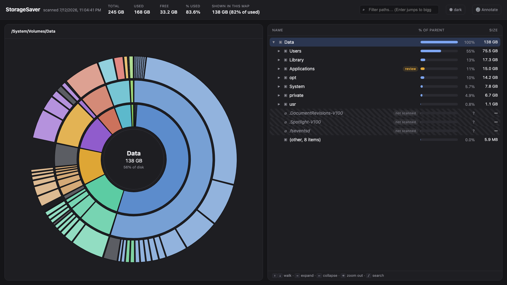

<div align="center">

# 💾 StorageSaver

**See what's eating your Mac's disk, understand it in plain English, and reclaim space safely.**



One command. No install. Read-only by design.

</div>

## Quickstart

```bash
npx storagesaver
```

That's it. StorageSaver walks your disk (about 45 to 90 seconds for a full scan), writes a self-contained `storagesaver.html` to the current directory, and opens it in your browser. Nothing is uploaded, nothing is deleted, nothing else is written.

## Features

- **Fast full-disk scan.** Walks the whole data volume in roughly 45 seconds to a minute and a half, using allocated blocks (not logical sizes) so sparse files like Docker's VM disk don't lie to you.
- **Sunburst + tree explorer.** A zoomable radial map plus a drill-down tree, all in one offline HTML file you can archive or share.
- **Plain-English "what is this?" tooltips.** Hundreds of built-in and community-seeded notes explain what folders actually are. Fill in the rest with AI: use the ⚙️ Annotate panel inside the report, or run `storagesaver annotate` from the CLI.
- **Bring your own AI endpoint.** Any OpenAI-compatible chat API works: Ollama, LM Studio, OpenAI, Anthropic's compatibility endpoint. Default is a local Ollama, so nothing leaves your machine.
- **Safety badges with copy-paste commands.** Every recognized path gets a badge: 🟢 safe (regenerable, with the exact command to reclaim it), 🟡 review (app-managed, decide first), 🔴 never (deleting causes real, sometimes cloud-propagating, loss).
- **Read-only by design.** StorageSaver never deletes, moves, or executes anything. You copy the commands you agree with; you stay in control.
- **Agent/watcher integration.** A bundled skill turns it into a scheduled storage watcher with severity tiers and debounced alerts (see below).

## CLI reference

```
storagesaver [scan]            scan → storagesaver.html → open in browser
storagesaver annotate [file]   fill tooltips in an existing report via your LLM

  --root <path>     scan root (default: /System/Volumes/Data on macOS)
  --min-mb <n>      hide nodes smaller than this (default 20)
  --quick           scan your home folder only (the user-actionable bulk)
  --out <file>      output path
  --json            emit the raw data tree as JSON instead of HTML
  --no-open         don't open the report in a browser

  --endpoint <url>  annotate: OpenAI-compatible endpoint (default: local Ollama)
  --model <name>    annotate: model name (required)
  --key <key>       annotate: API key if the endpoint needs one
  --dry             annotate: list what would be asked, don't call the model
```

## Configuration

Everything lives under `~/.config/storagesaver/`:

| File | Purpose |
|---|---|
| `config.json` | `{ "endpoint": "…", "model": "…", "key": "…" }` defaults for `annotate` (env vars `STORAGESAVER_ENDPOINT` / `STORAGESAVER_MODEL` / `STORAGESAVER_KEY` and CLI flags override it, flags win) |
| `notes-cache.json` | your own AI-generated tooltip notes; merged over the shipped seed notes |
| `rules.json` | your safety-rule overlay (below) |
| `watcher-state.json`, `watcher.log`, `reports/` | watcher state, log, and JSON report history |

### Custom safety rules (`rules.json`)

Add your own knowledge without forking:

```json
{
  "safe":   [{ "match": "~/renders/cache", "note": "re-renders from project files", "cmd": "rm -rf ~/renders/cache" }],
  "review": [{ "match": "Steam", "note": "uninstall games via Steam, not rm" }],
  "never":  [{ "match": "~/Documents/vault/*", "note": "the only copy of my archive" }]
}
```

A `match` containing `/` is an exact path (`~` expands; trailing `/*` covers everything underneath). A bare name matches any file or folder with that basename. Your rules win over the builtins, and `never` beats `review` beats `safe` on overlap.

## Scheduled watching (agents / cron)

The `skill/` directory contains a ready-made watcher and an agent skill definition (built for [OpenClaw](https://openclaw.ai)-style agents, usable from plain cron too):

```bash
NOTIFY_CMD='mail -s "Mac storage" you@example.com' node skill/watcher.js
```

- Severity tiers: below 70% used it stays silent; 70/85/95% step up the tone.
- Debounce: the same severity within 6 days doesn't re-alert.
- `NOTIFY_CMD` gets the alert text on stdin and the fresh HTML report path as `$1`, so any channel that can attach a file works.
- Verified staleness: apps are only called "unused" after checking they aren't running (`pgrep` by executable path), aren't login items, and have no recent Spotlight/prefs/container signals. See `skill/SKILL.md` for the full playbook.

## Check out these other great projects

If StorageSaver isn't quite your thing, this space has excellent tools worth a look: [DaisyDisk](https://daisydiskapp.com/) (the polished paid classic), [GrandPerspective](https://grandperspectiv.sourceforge.net/) (free treemaps since forever), [mole](https://github.com/tw93/mole) (terminal-first Mac maintenance), [Radix](https://radix.colinkim.dev/), and [SpaceRadar](https://github.com/zz85/space-radar). StorageSaver's own angle is the plain-English explanations, the curated safety knowledge, and the agent integration — and it never deletes anything.

## FAQ

**Does it work on Linux/Windows?**
It runs anywhere Node 18+ runs, but the safety rules and notes are written for macOS paths. On other platforms you'll get sizes and structure with a warning, not much wisdom. Contributions welcome.

## License

MIT © 2026 Scott Nelson. See [LICENSE](LICENSE).
